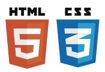
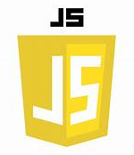

## _2º Proyecto sobre una réplica de una cónsola tipo Gameboy o similar (semana 2)_"

​

Desarrollada como parte del proceso de aprendizaje para el desarrollo de páginas web del Bootcamp de Full Stack Developer de Geekshubs Academy, en Valencia

___
​ 
<h5> Tecnologías utilizadas</h5>

​

HTML5, CSS3 y JavaScript.

​
[Enlace Proyecto Reto 2 Consola - Noelia Marcos](https://github.com/Noeliamll76/Reto2-consola.git)
​

___
## Tabla de contenidos
​​
- [Consola Nintendo Switch ](#Nintendo-Switch)
- [👩🏻‍💻 Descripción del proyecto](#Descripción)
- [🔍 Observaciones](#Observaciones)
- [⚖️ Licencia y Copyright](#licencia-y-copyright)
 
​

### Nintendo Switch

​Esta consola desarrollada por NINTENDO, salió a la venta en  marzo de 2017.

Se puede utilizar como consola de sobremesa con la unidad principal insertada en una estación de acoplamiento para conectarla con un televisor, y además, puede ser extraída de la base y utilizada de forma similar a una tableta a través de su pantalla táctil o colocada sobre una superficie gracias a su soporte plástico integrado siendo así visible por varios jugadores.

La Switch utiliza dos controladores inalámbricos llamados Joy-Con, que incluyen cuatro botones de acción y un joystick.

Es una consola personalizable, pueden varias los colores de los Joy-Con, pero en esta réplica utlizaré los colores basicos azul y rojo.

___
### Descripción
​
La web consta de 1 pagina HTML llamada *index.html*, con una carpeta CSS que contiene una hoja de estilo llamada *estilos.css*, una carpeta JS aque contiene un archivo *main.js* y una carpeta de IMAGENES con las imágenes utilizadas en la web y en este *readme.md*.

Se compone de:

​- Una réplica de la CONSOLA NINTENDO SWITCH, con el diseño mediante **DIV** Y **BUTTON**

- 🏠**INDEX.HTML**: El codigo HTML he creado un _container-fluid_ y está codificado con BUTTON y STYLE en un Joy-Con, y con BUTTON y 2 tipos de CLASS en el otro, consiguiendo el mismo resultado.

- **ESTILOS.CSS**: En este archivo he utilizado varios tipos de _shadow_ para conseguir el efecto de profundidad, relieve y efecto de pantalla encendida de la consola.

- **MAIN.JS**: Contiene el código necesario para el control de las diferentes pantallas.

Los botones que están activados son:
- El boton de encendido y apagado. 
    Cuando se enciende la pantalla aparece una imagen de encendido de Nintendo.
    Cuando se apaga, aparece una pantalla en gris oscuro.
- El pulsador izquierdo que al activarse, aparece una imagen de presentación del juego de Mario Bros.
- El pulsador derecho que al activarse, aparece una imagen en pleno juego.
​Estos dos pulsadores solo se activan si el boton de encendido está activado.

​___

### Observaciones: 
​
-  Me gustaría añadirle más opciones como un vídeo corto emulando un juego, pero todavía me queda mucho por aprender.
Me ha costado mucho el volver a una imagen de apagado despues de poner varias imágenes, ya que tenía que vaciar primero la variable que contenía la anterior imagen que se superponía al backgroundColor en Js.

​___

### Agradecimientos:

Como en la anterior ocasión, debo y quiero agradecer a todos mis compañeros del Bootcamp, por su paciencia y su ayuda, siempre están ahí mostrando su mejor versión cada vez que alguien está perdido.
Muchisimas gracias.

### Licencia y copyright
📝 La licencia utilizada es una MIT License.
Este proyecto ha sido realizado por Noelia Marcos, sin utilizar ninguna web como base, ni tampoco modificando ninguna existente.